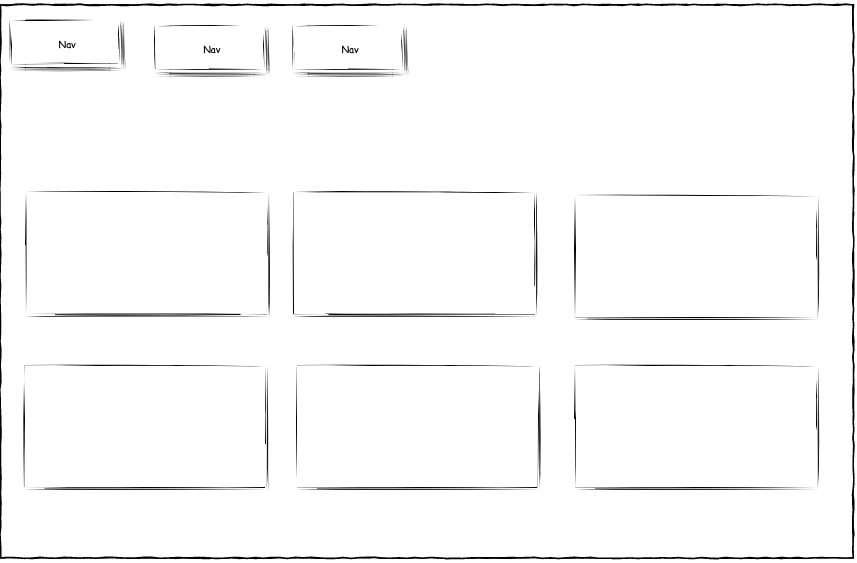
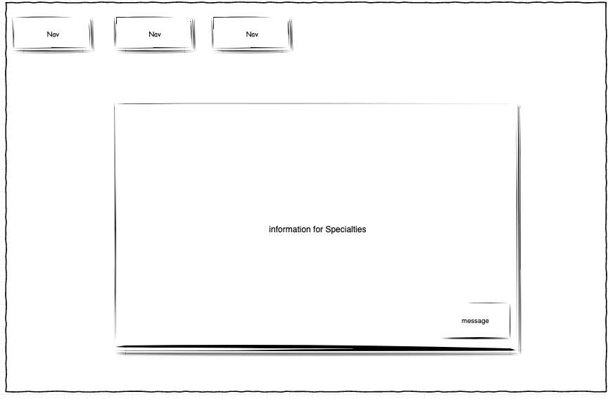
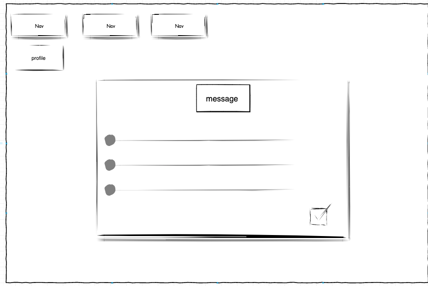
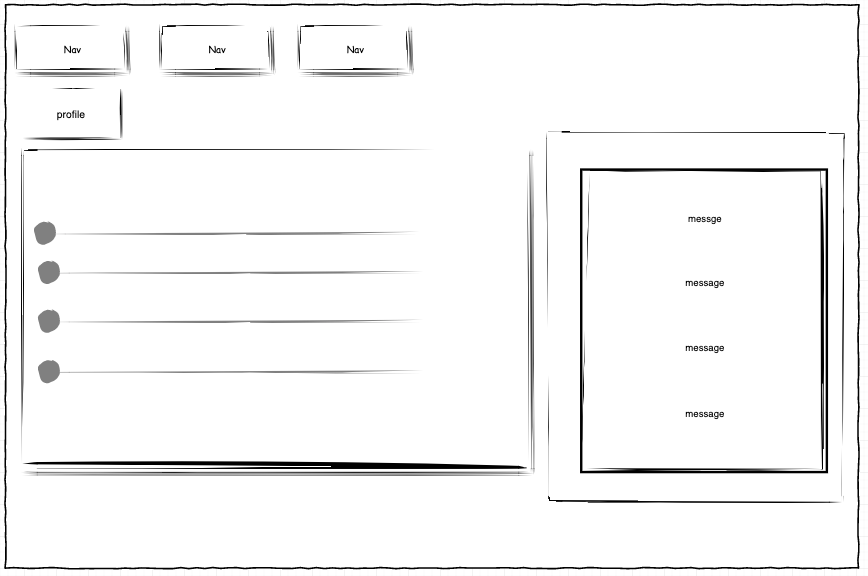
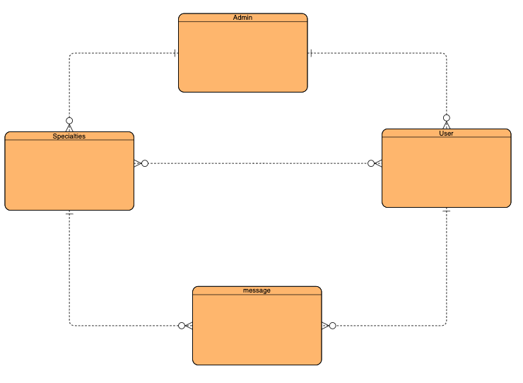

#`Project Idea:`

An application through which the user can search for people with specific specialties and can exchange messages with them

#`User story:`

```
As a user , I can see all Specialties in Home page
As a user , I can click on specific Specialty
As a user , I can see information about specific Specialty
As a user , I can send message to more than Specialty
As as a user , I can edit my profile

As a Specialty , I can see all message and repeat
As a Specialty , I can edit my profile

As a user I can delete Specialty
As a user I can see all Specialty information
As a user I can delete user
As a user I can see all user information
```

#`Wireframes`:





#`ERD`:

